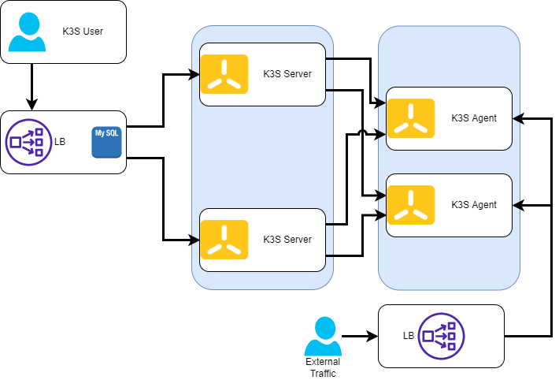

# K3S-LightweightKubernetes
## Setup High Availability Kubernetes Cluster with K3s

In this installation I use 4 servers in total, later this cluster can grow by adding more nodes to the cluster.
- 1 Load Balancer + DB
- 2 K3S Server (Master Node)
- 2 K3s Agent (Worker Node)

Installation used as below:
- **OS :** Rocky 8.7
- **Load Balancer :** Nginx
- **External DB :** MySQL 8.0
- **K3S version :** v1.26.9-rc1+k3s1

Installation Diagram:



Installation steps:
- 1 [nginx](https://github.com/luthfanzulfauzi/K3S/blob/main/nginx/docs/install.md)
- 2 [mysql](https://github.com/luthfanzulfauzi/K3S/blob/main/mysql/docs/mysql_install.md)
- 3 [K3S server](https://github.com/luthfanzulfauzi/K3S/blob/main/server/docs/k3s_server_install.md)
- 4 [K3S agent](https://github.com/luthfanzulfauzi/K3S/blob/main/agent/docs/k3s_agent_install.md)
- 5 Export kubeconfig [k3s.yaml](https://github.com/luthfanzulfauzi/K3S/blob/main/server/config/k3s.yaml)
```
export KUBECONFIG=~/.kube/k3s.yaml
```
